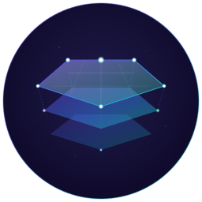

<p align="center">
  
</p>

<h1 align="center">Surface Protocol</h1>

<p align="center">
  <a href="https://github.com/surface-protocol/surface-protocol/actions/workflows/ci.yml"></a>
  <a href="https://www.npmjs.com/package/@surface-protocol/cli"></a>
  <a href="LICENSE"></a>
</p>

<p align="center">
  <em>Tests are the spec. surface.json is the queryable truth. Git is the backbone.</em>
</p>

---

Product continuity for AI-driven development.

## What Is This?

AI agents work one shot at a time. But one shot after one shot doesn't build a product that users get used to, love, and rely on. Without knowing the product's **surface** — the interactions, touchpoints, and interfaces users actually see and touch — agents reshape things that should stay stable.

Surface Protocol makes the product surface explicit by embedding requirements **in the tests themselves**. `surface.json` is the queryable truth — a structured map of every touchpoint, so agents know what the product looks like before they change it. Install it, and you get:

- **A CLI** for generating and querying the surface map
- **A Claude Code plugin** with AI-powered skills for capturing and implementing requirements
- **Git hooks** for pre-commit validation
- **Constraint enforcement** for architectural guardrails

## The Fundamental Insight

**Requirements become tests. Then requirements are thrown away.**

```
+-----------------------------------------------------------------------------+
|                    USER INPUT -> PRODUCT FLOW                               |
+-----------------------------------------------------------------------------+
|                                                                             |
|  +-------------------+                                                      |
|  |  USER INPUT       |  GitHub Issue, description, bug report               |
|  |  (Requirements)   |  "We need biometric verification for patients"       |
|  +---------+---------+                                                      |
|            |                                                                |
|            v                                                                |
|  +-------------------+                                                      |
|  |  TEST STUB        |  it.todo() with FULL YAML metadata                   |
|  |  (REQ captured)   |  summary, rationale, acceptance criteria             |
|  +---------+---------+                                                      |
|            |                                                                |
|            v                                                                |
|  +-------------------+                                                      |
|  |  PRD DIES         |  Original doc is now OBSOLETE                        |
|  |  (Test is truth)  |  The test IS the requirement now                     |
|  +---------+---------+                                                      |
|            |                                                                |
|            v                                                                |
|  +-------------------+                                                      |
|  |  SURFACE.JSON     |  THE QUERYABLE TRUTH - generated from test metadata  |
|  |  (Queryable map)  |  Rich, queryable, CANNOT drift from reality          |
|  +---------+---------+                                                      |
|            |                                                                |
|            v                                                                |
|  +-------------------+                                                      |
|  |  IMPLEMENTATION   |  Code written to make test pass                      |
|  |  (Test passes)    |  it.todo() -> it() with real assertions              |
|  +---------+---------+                                                      |
|            |                                                                |
|            v                                                                |
|  +-------------------+                                                      |
|  |  PRODUCT          |  Feature shipped, requirement traceable forever      |
|  |  (Shipped)        |  Query surface.json to understand any code           |
|  +-------------------+                                                      |
|                                                                             |
+-----------------------------------------------------------------------------+
```

## Quick Start

### Install the CLI

```bash
npm install -D @surface-protocol/cli
# or
bun add -D @surface-protocol/cli
```

### Install the Claude Code Plugin

```bash
claude plugin add surface-protocol
```

### Initialize Your Project

```bash
npx surface init
# or with a specific adapter:
npx surface init --adapter ruby-rspec
```

This creates `surfaceprotocol.settings.json`, an empty `surface.json`, `SURFACE.md`, and the `.surface/` state directory.

### Generate Your Surface Map

```bash
# Generate surface.json, SURFACE.md, and docs/features/
npx surface gen

# Check coverage and find gaps
npx surface check

# Capture a requirement (via Claude Code plugin)
/surface:capture #123

# Capture AND implement in one go
/surface:ship #123
```

## Supported Stacks

| Adapter | Languages | Test Framework | Status |
|---------|-----------|----------------|--------|
| `typescript-vitest` | TypeScript/JavaScript | Vitest, Playwright | Stable |
| `ruby-rspec` | Ruby | RSpec | Stable |

More adapters welcome. See [docs/architecture.md](docs/architecture.md) for how to build one.

## Claude Code Skills

The primary interface for Surface Protocol. Use these commands in Claude Code:

### Hybrid Mode (Auto-Detection)

**Surface Protocol automatically detects feature requests and offers to capture them.**

When you say something like:
- "Create a react component that shows hello world in pink"
- "Add a feature that lets users export data"
- "Fix the bug where users can't log in"

The agent will recognize it and offer options: **capture**, **ship**, **just do it**, or **skip**.

### Explicit Commands

| Command | Description |
|---------|-------------|
| `/surface:capture <input>` | Parse input, create test stubs with metadata, commit spec |
| `/surface:ship <input>` | Capture + implement in one flow |
| `/surface:implement [REQ-ID]` | Pick up pending stubs and implement them |

**Natural language works too:**
```
/surface:capture #123 and implement it
/surface:capture "Add user auth" and ship it
```

### Query & Validate

| Command | Description |
|---------|-------------|
| `surface gen` | Generate surface.json + SURFACE.md + docs/features/ |
| `surface check` | Validate coverage, freshness, gaps, overrides, lifecycle |
| `surface check --coverage` | Coverage report by type and area |
| `surface query --file <path>` | Requirements for a file |
| `surface query --dangerous` | Show DANGEROUS requirements |
| `surface query --staged` | Requirements in staged files |
| `surface metrics` | Adoption metrics (routed vs. bypass) |

### Troubleshooting

| Command | Description |
|---------|-------------|
| `/surface:problem <description>` | Systematic problem resolution with learning capture |
| `/surface:quickfix <description>` | Fast-track for scoped fixes |
| `/surface:learn` | Capture learnings from the current thread |

## Two-Phase Workflow

Surface Protocol separates **specification** from **implementation**:

```
+-----------------------------------------------------------------------------+
|  PHASE 1: SPECIFICATION (spec commit)                                       |
|  ====================================                                       |
|  - Parse input (GitHub issue, description)                                  |
|  - Create test stubs with it.todo()                                         |
|  - Full YAML metadata (summary, rationale, acceptance)                      |
|  - Commit: spec(area): description                                          |
|  - Trailer: Surface-Protocol: capture                                       |
|  - CI shows pending tests (not failures)                                    |
|                                                                             |
|  PHASE 2: IMPLEMENTATION (feat commit)                                      |
|  =====================================                                      |
|  - Pick up pending stubs from surface.json                                  |
|  - Implement code to make tests pass                                        |
|  - Change it.todo() -> it() with assertions                                 |
|  - Commit: feat(area): description                                          |
|  - Trailer: Surface-Protocol: implement                                     |
|  - CI passes, deployment unblocked                                          |
+-----------------------------------------------------------------------------+
```

**Why two phases?**
- Spec commits are reviewable documentation
- Multiple agents can parallelize implementation
- surface.json IS the work queue
- Stubs capture rationale BEFORE code exists

## Test Metadata Format

Tests contain YAML frontmatter that becomes the source of truth:

```typescript
/*---
req: REQ-042
type: unit
status: pending
area: auth
summary: User authentication requires MFA for sensitive actions
rationale: |
  PCI-DSS requires strong authentication for payment operations.
  Account takeover can lead to financial loss.
acceptance:
  - Email verified
  - MFA challenge completed
tags: [auth, critical, compliance, user-facing]
source:
  type: github
  ref: "#234"
  url: https://github.com/org/repo/issues/234
changed:
  - date: 2026-02-04
    commit: abc123f
    note: Initial stub created
---*/
it.todo('requires MFA for sensitive actions')
```

### Status Values

| Status | Meaning | Test Syntax |
|--------|---------|-------------|
| `pending` | Stub exists, awaiting implementation | `it.todo()` |
| `implemented` | Test has real assertions, passes | `it()` |
| `active` | Implemented and actively maintained | `it()` |
| `skipped` | Intentionally skipped with reason | `it.skip()` |
| `deprecated` | Being phased out | tagged |
| `consolidated` | Merged into another requirement | tagged |
| `archived` | No longer relevant, preserved for history | tagged |

## Test Types

| Type | Purpose | YAML Field | ID Prefix | Surface Map Bucket |
|------|---------|------------|-----------|-------------------|
| `unit` | Atomic requirements | `req` | `REQ-` | `requirements[]` |
| `functional` | Component behavior | `func` | `FUNC-` | `requirements[]` |
| `performance` | Non-functional requirements | `perf` | `NFR-` | `requirements[]` |
| `security` | OWASP coverage | `sec` | `SEC-` | `requirements[]` |
| `regression` | Discovered truths from bugs | `regr` | `REGR-` | `regressions[]` |
| `e2e` | Flow verification | `flow` | `FLOW-` | `flows[]` |
| `contract` | API boundaries | `contract` | `CONTRACT-` | `contracts[]` |
| `smoke` | Deployment health | `smoke` | `SMOKE-` | `smoke[]` |

## Impact Classification

The protocol uses **binary** impact classification:

| Tag | Meaning | Classification |
|-----|---------|----------------|
| `critical` | Data integrity, financial loss | **DANGEROUS** |
| `compliance` | Regulatory (PCI, SOC2, HIPAA, GDPR) | **DANGEROUS** |
| `security` | Security boundary | **DANGEROUS** |
| `blocking` | Deployment blocker | **DANGEROUS** |
| (others) | Standard importance | SAFE |

### Audience Tags

| Tag | Audience | Change Sensitivity |
|-----|----------|-------------------|
| `user-facing` | End users / customers | HIGH |
| `admin-facing` | Admin / internal users | MEDIUM |
| `backend` | No direct users | LOW |

When touching DANGEROUS requirements, agents must:
1. Confirm with user before proceeding
2. Document in commit message
3. May require override for certain changes

## Override Protocol

When blocked by a requirement, users can grant an override:

```
OVERRIDE REQ-042: Emergency feature needed before compliance review completes
```

The agent then adds audit metadata:

```yaml
override_approved: 2026-02-02
override_reason: Emergency feature needed before compliance review completes
override_expires: 2026-03-01
```

## Constraints

The optional `constraints.json` file defines what agents **cannot** do:

```json
{
  "components": {
    "forbidden": ["material-ui", "chakra-ui"],
    "allowed_sources": [{ "source": "shadcn" }]
  },
  "dependencies": {
    "forbidden": ["axios", "lodash", "moment"]
  },
  "patterns": {
    "forbidden": ["inline-styles", "css-in-js-runtime"]
  }
}
```

## Generated Files

These files are generated and should **never be edited manually**:

- `surface.json` - The queryable truth (THE QUERYABLE TRUTH)
- `SURFACE.md` - Human-readable surface map
- `docs/features/` - Per-area feature documentation

Run `surface gen` to regenerate them.

## Configuration

### surfaceprotocol.settings.json

```json
{
  "adapter": "typescript-vitest",
  "testFilePatterns": ["**/*.test.ts", "**/*.spec.ts"],
  "idPrefixes": {
    "requirement": "REQ",
    "flow": "FLOW",
    "contract": "CONTRACT",
    "smoke": "SMOKE",
    "regression": "REGR",
    "functional": "FUNC",
    "performance": "NFR",
    "security": "SEC"
  },
  "output": {
    "surfaceJson": "surface.json",
    "surfaceMd": "SURFACE.md",
    "featureDocs": "docs/features"
  },
  "tagCategories": {
    "dangerous": ["critical", "security", "compliance", "blocking"],
    "audience": ["user-facing", "admin-facing", "backend"]
  },
  "commitConventions": {
    "specPrefix": "spec",
    "implPrefix": "feat",
    "requireAffects": true,
    "trailerValues": ["capture", "implement", "ship", "quickfix", "problem", "learn", "reconcile"]
  }
}
```

## Philosophy

### The Death of the PRD

```
+-----------------------------------------------------------------------------+
|                         THE DEATH OF THE PRD                                |
+-----------------------------------------------------------------------------+
|                                                                             |
|  Day 1: PRD is born, considered authoritative                               |
|  Day 2: Test stub created with YAML metadata from PRD                       |
|  Day 3: Implementation complete, test passes                                |
|  Day 4: PRD is OBSOLETE - the test IS the requirement now                   |
|                                                                             |
|  The test CANNOT drift from reality. It either passes or fails.             |
|  The PRD CAN drift. That's why we kill it.                                  |
|                                                                             |
|  surface.json = THE QUERYABLE TRUTH (queryable, complete, never lies)       |
|  Git commits = THE DOCUMENTATION (history, blame, changelog)                |
|  Tests = THE REQUIREMENTS (pass = met, fail = violated)                     |
|                                                                             |
+-----------------------------------------------------------------------------+
```

### Git-Centric Philosophy

```
+---------------------------------------------------------------------------+
|                         GIT IS OUR FRIEND                                 |
+---------------------------------------------------------------------------+
|                                                                           |
|  - Git history IS the changelog                                           |
|  - Commit messages ARE documentation                                      |
|  - Blame IS authorship tracking                                           |
|  - Commits ARE referenced in tests and surface map                        |
|                                                                           |
|  Every commit tells a story. Make it a good one.                          |
|                                                                           |
+---------------------------------------------------------------------------+
```

## Project Status

This is a **proof of concept** (v0.x). We're looking for:

- Feedback on the core concept
- Battle testing against real projects
- Contributions for new stack adapters
- Challenges from practitioners who've tried similar approaches

If you think this is brilliant, tell us why. If you think it's terrible, tell us why louder. [Open an issue](https://github.com/surface-protocol/surface-protocol/issues).

## Documentation

- [Glossary](docs/glossary.md) — All terms defined
- [Status Model](docs/status-model.md) — How the three status dimensions relate
- [YAML Reference](docs/yaml-reference.md) — All metadata fields with examples
- [Architecture](docs/architecture.md) — Adapter system and data flow
- [Philosophy](docs/philosophy.md) — Why this exists
- [Placeholders](docs/placeholders.md) — Tracking planned UI touchpoints
- [Configuration](docs/configuration.md) — Full config reference

## Contributing

See [CONTRIBUTING.md](CONTRIBUTING.md) for development setup and guidelines.

## License

MIT

---

*Surface Protocol v2.0*\
*Tests are the spec. surface.json is the queryable truth. Git is the backbone.*
